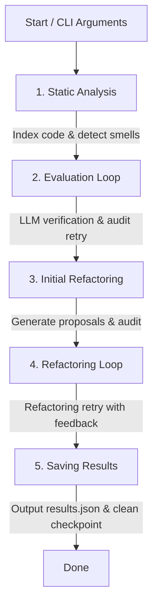

# Code Smell Evaluation and Refactoring Pipeline

An agentic, multi-stage LLM pipeline designed to identify, evaluate, and refactor code smells using a **Generator-Auditor (Critic)** feedback loop architecture.

---

## 1. Pipeline Architecture & Workflow

The system is structured as a sequential pipeline with robust state checkpointing. If the process is interrupted, it can resume from the last completed stage.



### Stages Breakdown:
1.  **Static Analysis (`static_analysis`)**: Indexes the target source file using vector embeddings (stored in a local Chroma DB) to provide RAG context, and runs static analysis tools (currently a placeholder) to discover candidate smells.
2.  **Evaluation Loop (`eval_loop`)**: 
    *   **Evaluator**: Uses an LLM to assess if the code smell candidate is valid based on a defined set of heuristics.
    *   **Auditor**: Audits the evaluation against a quality rubric. If rejected, the critique is fed back to the Evaluator for correction (up to `MAX_TENTATIVES` attempts).
3.  **Initial Refactoring (`initial_refactoring`)**: Generates an initial code refactoring proposal for each accepted smell and submits it to the Refactoring Auditor.
4.  **Refactoring Loop (`refactoring_loop`)**: Re-runs the Refactoring Evaluator-Auditor feedback loop on rejected proposals, incorporating audit critiques until approved or maximum attempts are reached.
5.  **Saving (`saving`)**: Outputs the finalized list of evaluated smells and approved refactorings to `data/results_<filename>.json` and cleans up the active checkpoint file.

---

## 2. File Directory Structure

*   `main.py`: The entry orchestrator that manages pipeline execution flow, signal handlers, and checkpoints.
*   `constants.py`: Houses global parameters (e.g., RAG chunking parameters, maximum iteration limits, embedding models, and stages sequence).
*   `config.json`: Declares LLM specifications and endpoints for both local development (Ollama) and cloud APIs (Mistral, Gemini).
*   `data/`
    *   `heuristics.json`: Categorized rulesets for evaluating code smells (e.g., God Class, Feature Envy, Primitive Obsession).
    *   `results_*.json`: Finalized output from successful pipeline executions.
    *   `checkpoint.json`: Temporal state cache used to resume interrupted runs.
*   `src/`
    *   `start.py`: Configures system initialization, loads files, and handles CLI argument validation.
    *   `static_ana.py`: Performs static smell analysis and executes MMR (Maximal Marginal Relevance) context queries.
    *   `indexer.py`: Chunks the codebase and populates the local Chroma DB.
    *   `llm.py`: A wrapper around `litellm.completion` to invoke models with schema-enforced structured outputs.
    *   `schemas.py`: Pydantic validation schemas enforcing structured outputs from the LLMs (evaluation, refactoring, and their audits).
    *   `models.py`: Lightweight data structures defining configuration and state containers.
    *   `prompt.py`: Prompt templates used to communicate tasks and audit comments to the LLMs.
    *   `utils.py`: Central feedback retry loops and checkpointing utilities.
    *   `exceptions.py`: Custom pipeline exception classes.

---

## 3. Configuration & Setup

### Environment Setup
Create a `.env` file in the root of the `Shared` folder matching `.env.example`:
```ini
MISTRAL_API_KEY="your_mistral_key"
GEMINI_API_KEY="your_gemini_key"
```

### Models Configuration
Define the models you want to use in `config.json`:
```json
{
    "local": {
        "eval_model": "ollama/mistral3:3b",
        "j_eval_model": "ollama/gemma4:e4b",
        "ref_model": "ollama/mistral3:3b",
        "j_ref_model": "ollama/gemma4:e4b"
    },
    "cloud": {
        "eval_model": "mistral/mistral-medium-latest",
        "j_eval_model": "gemini/gemini-3.5-flash",
        "ref_model": "mistral/mistral-codestral-latest",
        "j_ref_model": "gemini/gemini-3.5-flash"
    }
}
```

---

## 4. How to Run

Execute the pipeline using the command line:

### 1. Fresh Run
To analyze a file from scratch:
```bash
python main.py path/to/target_code_file.py
```

### 2. Resume Run
If a previous execution was interrupted (via Ctrl+C or a crash), resume from the last saved checkpoint:
```bash
python main.py --resume
```

### 3. Force Fresh Run
Start a fresh run even if a checkpoint exists (will delete the old checkpoint):
```bash
python main.py path/to/target_code_file.py --force
```

### 4. Local Execution
Use models configured under `local` (e.g. Ollama) without making requests to Cloud APIs:
```bash
python main.py path/to/target_code_file.py --local
```

### 5. Evaluation Only
Evaluate code smells without generating refactoring proposals:
```bash
python main.py path/to/target_code_file.py --eval
```
